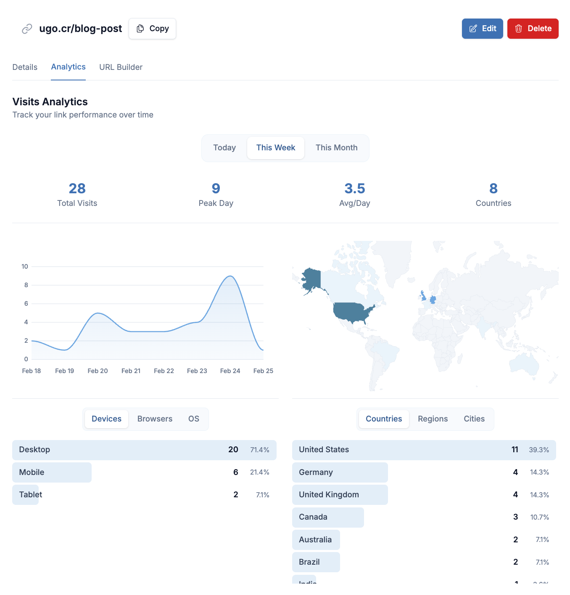

# ugo


Shorten links, track engagement, and own your data. ugo is an open source URL shortener with built-in analytics, QR codes, UTM tagging, and team workspaces. Self-host it on your own infrastructure or get started at [ugo.cr](https://ugo.cr)



## Self-host in one command

```bash
curl https://get.once.com | sh
# Choose "Enter a Docker image path" → ghcr.io/fdocr/ugo
```

## Documentation

- [Local Quickstart](docs/local-quickstart.md)
  - Set up a development environment and learn about the codebase
- [Self-Hosting Guide](docs/self-hosting.md)
  - Deploy ugo on your own server with the Once CLI
- [Deep linking](docs/deep-linking.md)
  - Native app bounce redirects at `/r?r=` (Dedicated and self-hosted)
- [Codebase analysis (HTML slides)](docs/codebase-analysis-slides-2026-04-11.html)
  - Technical deep dive and SWOT-style business notes (open in a browser)

## License

ugo is released under the [O'Saasy License](LICENSE.md).
